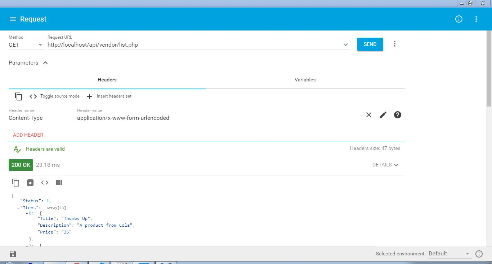

General Store App API in PHP
=====

# Description
This is a General Store App API in PHP which includes Customer and Vendor Signup and login and fetching a list of Products from product table using API.

# Overview
 Getting a list of products in JSON format from product table
 

# Author
[Azeem Aijaz](https://azeemaijaz.github.io/)

If you have any questions and commissions for me, feel free to tell me.
